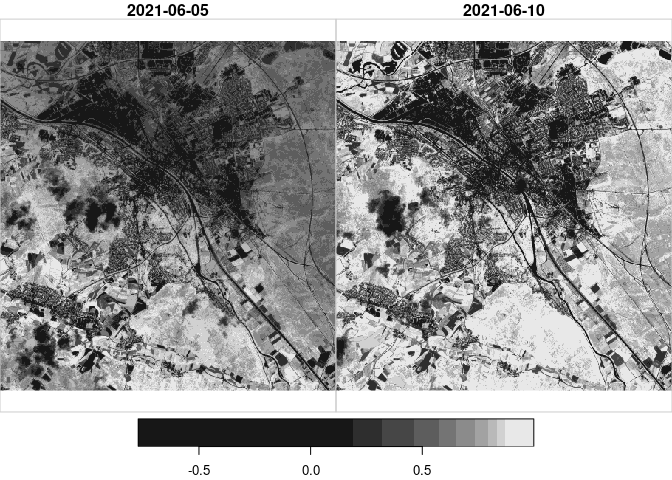

Available online:
[Open-EO/openeo-geopyspark-driver\#89](https://github.com/Open-EO/openeo-geopyspark-driver/issues/89#issuecomment-878979245)

    ### pkgs ----

    library(sf)
    library(mapview)
    library(reticulate)

    ### aoi ----

    ## write sample aoi to .geojson
    tmp = tempfile(
      fileext = ".geojson"
    )

    franconia |> 
      st_cast(
        "POLYGON"
        , warn = FALSE
      ) |> 
      st_write(
        dsn = tmp
        , quiet = TRUE
        , delete_dsn = TRUE
      )

    ## define target file for download
    ofl = tempfile(
      fileext = ".ncdf"
    )

    ### mdls ----

    import openeo
    import json

    ### area of interest ----

    with open(r.tmp) as f:
        aoi = json.load(f)

    jsn = aoi['features'][0]['geometry']
    print(jsn)

    ### openeo ----

    ## connect backend

    ## {'type': 'Polygon', 'coordinates': [[[10.925805500000024, 49.9250725], [10.931428, 49.9211555], [10.9406735, 49.91436349999998], [10.94944750000002, 49.9007075], [10.9530115, 49.87713], [10.946913, 49.871189001], [10.959998499999982, 49.849589], [10.95114, 49.8559945], [10.928587, 49.85034150000001], [10.929148, 49.843151], [10.9264985, 49.842468], [10.913484, 49.84652000099999], [10.882088, 49.855896499999965], [10.881524500000012, 49.8585165], [10.866568500000028, 49.8681565], [10.84401250000002, 49.882622], [10.83332, 49.88080050000002], [10.831175, 49.892692], [10.843639, 49.904171], [10.847361499999977, 49.90841550099998], [10.830088, 49.91462950099998], [10.832847, 49.91462149900002], [10.837785, 49.915435000999985], [10.876013, 49.91303850000002], [10.8864135, 49.9206605], [10.913475, 49.925442], [10.925805500000024, 49.9250725]]]}

    con = openeo.connect(
        'https://openeo.vito.be'
    ).authenticate_oidc('egi')

    ## load collection

    ## Authenticated using refresh token.

    datacube = con.load_collection(
        'SENTINEL2_L2A_SENTINELHUB'
        , spatial_extent = jsn
        , temporal_extent = ['2021-06-01','2021-06-10']
        , bands = ['B04', 'B08']
    )

    ## add index layer
    datacube = datacube.ndvi(
        nir = 'B08'
        , red = 'B04'
        , target_band = 'ndvi'
    )

    ## download data
    datacube.download(
        outputfile = r.ofl
        , format = 'NetCDF'
    )

    ## Loading required package: abind

    ## no 'var' specified, using B04, B08, ndvi

    ## other available variables:
    ##  spatial_ref, t, x, y

    ## Warning in .get_nc_projection(meta$attribute, rep_var, all_coord_var): No
    ## projection information found in nc file.

    ## downsample set to c(2,2,1)

